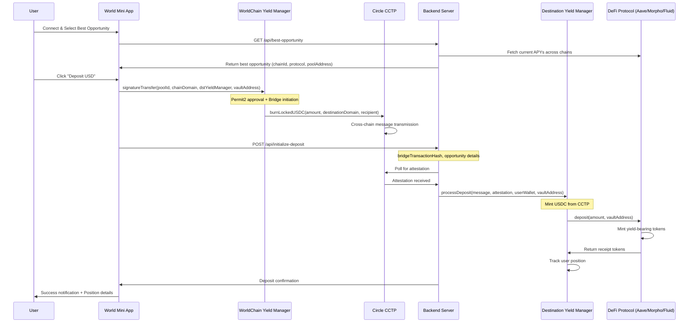
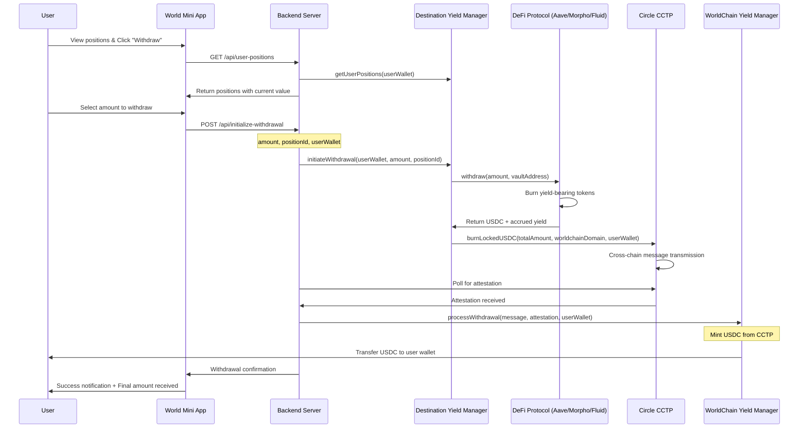

# 🌍 Monde - DeFi Yield Optimization Platform


 **A World Mini App to farm the best yield on the Earth**


Monde is a comprehensive DeFi yield optimization platform that automatically finds and manages the best yield opportunities across multiple EVM chains using Circle's Cross-Chain Transfer Protocol (CCTP) for seamless cross-chain operations.

## 🏗️ Architecture Overview

This platform consists of several interconnected components working together to provide a seamless yield farming experience:

```
USER → WorldCoin App → Backend Server → Smart Contracts → Protocols (Morpho, AAVE, Fluid)
  ↓                        ↓                ↓
World ID Wallet      API Endpoints    Circle CCTP    
  ↓                        ↓                ↓
Connect & Verify     Yield Discovery   Cross-Chain Bridge
```

## 🔧 Core Components

### 1. **WorldCoin Mini App** 📱
- **Purpose**: Frontend interface for users to interact with the platform
- **Technology**: Next.js with WorldCoin Mini App UI Kit
- **Features**:
  - World ID authentication and verification
  - Yield opportunity discovery
  - One-click deposit/withdraw interface
  - Real-time portfolio tracking

### 2. **Backend Server** 🖥️
- **Purpose**: API server handling data aggregation and business logic
- **Technology**: Node.js/TypeScript with Express
- **Key Endpoints**:
  - `/api/all` - Get all yield opportunities ordered by APY
  - `/api/best-opportunity` - Find the highest yielding pool
  - `/api/deposit` - Initiate cross-chain deposits
  - `/api/withdraw` - Process withdrawals
  - `/api/attestation` - Handle CCTP attestations

### 3. **Smart Contracts** 📜
- **Yield Manager Contract**: Deployed on multiple chains
- **Purpose**: Manage user positions and protocol interactions
- **Key Functions**:
  - `processDeposit()` - Handle incoming CCTP transfers
  - `initWithdraw()` - Initiate withdrawal process
  - `processWithdraw()` - Complete withdrawal with CCTP

### 4. **Circle CCTP Integration** 🔄
- **Purpose**: Enable seamless cross-chain USDC transfers
- **Supported Chains**: Ethereum, Arbitrum, Base, Optimism, World
- **Flow**:
  1. User approves USDC transfer
  2. Burn USDC on source chain
  3. Get attestation from Circle's API
  4. Mint USDC on destination chain
  5. Automatically deposit into best yield opportunity

## 🌐 Supported Chains & Protocols

### **Chains**
- **Ethereum** (Chain ID: 1, CCTP Domain: 0)
- **Arbitrum** (Chain ID: 42161, CCTP Domain: 3)
- **Base** (Chain ID: 8453, CCTP Domain: 6)
- **Optimism** (Chain ID: 10, CCTP Domain: 2)
- **World** (Chain ID: 480, CCTP Domain: 14)

### **Protocols**
- **AAVE V3**: Lending protocol with variable APY
- **Morpho**: Optimized lending with higher yields
- **Fluid**: Advanced liquidity protocol

## 🔄 CCTP Integration Deep Dive

### **What is CCTP?**
Circle's Cross-Chain Transfer Protocol (CCTP) is a permissionless on-chain utility that facilitates USDC transfers between blockchains via native burning and minting.

### **Our CCTP Implementation**

#### **1. Domain Mapping**
```typescript
export const getChainDomainMapping = (): Record<number, number> => {
  return {
    1: 0,     // Ethereum → Domain 0
    42161: 3, // Arbitrum → Domain 3
    8453: 6,  // Base → Domain 6
    10: 2,    // Optimism → Domain 2
    480: 14,  // World → Domain 14
  };
};
```

#### **2. Deposit Flow with CCTP**


#### **3. Withdrawal Flow with CCTP**



### **4. Attestation Service**
```typescript
interface AttestationMessage {
  message?: string;
  eventNonce?: string;
  attestation?: string;
  status: 'pending_confirmations' | 'complete';
}
```

## Contract Addresses

This directory contains all official contract addresses for the World App DeFi Yield Optimization Platform.

### 🏗️ Yield Manager Contracts

Our main smart contracts deployed across multiple chains:

| Network | Chain ID | Contract Address | Status |
|---------|----------|------------------|--------|
| Arbitrum | 42161 | `0x02CFa5cFd2D9A22019f62AC97626e06ae6D39139` | ✅ Deployed |
| Base | 8453 | `0x0DA9e9932925751EFd2e5e12E9e0B2219cC40271` | ✅ Deployed |
| Optimism | 10 | `0x99CEE82077422CC12E70680a31a04D67bb170094` | ✅ Deployed |
| World | 480 | `0x5dC767263481EFDD4d82C5CFF92Fe591Db2C1e67` | ✅ Deployed |

### 🔄 Circle CCTP Contracts

Circle's Cross-Chain Transfer Protocol contract addresses:

### TokenMessenger Contracts
| Network | Chain ID | Contract Address |
|---------|----------|------------------|
| Ethereum | 1 | `0xBd3fa81B58Ba92a82136038B25aDec7066af3155` |
| Arbitrum | 42161 | `0x19330d10D9Cc8751218eaf51E8885D058642E08A` |
| Base | 8453 | `0x1682Ae6375C4E4A97e4B583BC394c861A46D8962` |
| Optimism | 10 | `0x2B4069517957735bE00ceE0fadAE88a26365528f` |

### MessageTransmitter Contracts
| Network | Chain ID | Contract Address |
|---------|----------|------------------|
| Ethereum | 1 | `0x0a992d191DEeC32aFe36203Ad87D7d289a738F81` |
| Arbitrum | 42161 | `0xC30362313FBBA5cf9163F0bb16a0e01f01A896ca` |
| Base | 8453 | `0xAD09780d193884d503182aD4588450C416D6F9D4` |
| Optimism | 10 | `0x4d41f22c5a0e5c74090899E5a8Fb597a8842b3e8` |

