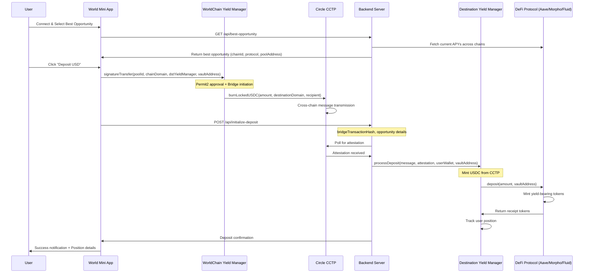
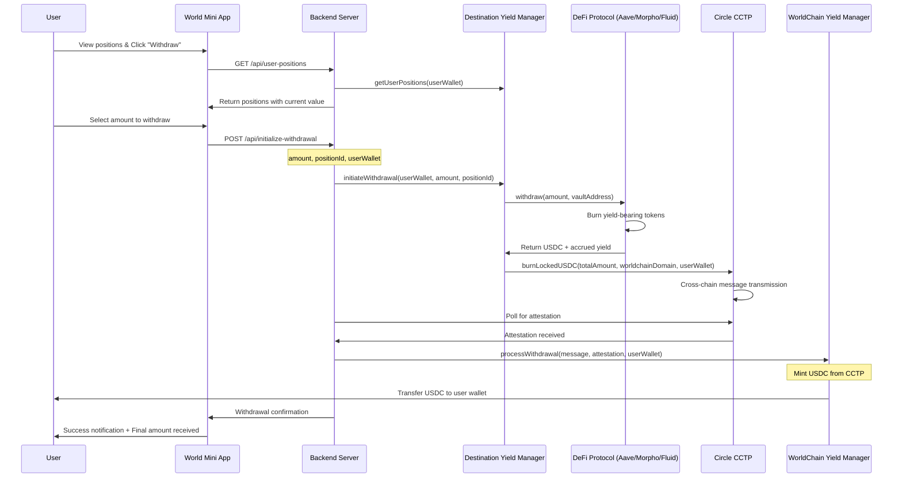

# 🌍 World App - DeFi Yield Optimization Platform


> **A World Mini App to farm the best yield on the Earth**

- [Circle Developer Documentation](https://developers.circle.com/)

World is a comprehensive DeFi yield optimization platform that automatically finds and manages the best yield opportunities across multiple EVM chains using Circle's Cross-Chain Transfer Protocol (CCTP) for seamless cross-chain operations.

## 📋 Bounty Submission Criteria

Submissions will be evaluated based on the following parameters:

### ✅ Required Components

1. **Functional MVP and Diagram**
   - Working frontend application
   - Backend infrastructure
   - Architecture diagram (see above)

2. **Video Demonstration + Presentation**
   - Succinct outline of core functions
   - Effective use of Circle's Developer tools/tech
   - Detailed documentation support

3. **Repository Link**
   - GitHub or Replit repository
   - Clean, well-documented code
   - Easy setup and deployment instructions

## 📚 Documentation Structure

```
docs/
├── README.md                 # This file
├── assets/                   # Images and diagrams
├── contract_addresses/       # Official contract addresses
│   ├── README.md            # Contract documentation
│   ├── yield-manager-contracts.ts
│   ├── cctp-contracts.ts
│   └── index.ts
├── architecture/             # Architecture documentation
├── api/                      # API documentation
├── contracts/                # Smart contract documentation
├── frontend/                 # Frontend implementation guide
├── backend/                  # Backend implementation guide
└── examples/                 # Code examples and tutorials
```

## 🏗️ Architecture Overview

Our platform consists of several interconnected components working together to provide a seamless yield farming experience:

```
USER → WorldCoin App → Backend Server → Smart Contracts → Protocols (Morpho, AAVE, Fluid)
  ↓                        ↓                ↓
World ID Wallet      API Endpoints    Circle CCTP    
  ↓                        ↓                ↓
Connect & Verify     Yield Discovery   Cross-Chain Bridge
```

## 🔧 Core Components

### 1. **WorldCoin Mini App** 📱
- **Purpose**: Frontend interface for users to interact with the platform
- **Technology**: Next.js with WorldCoin Mini App UI Kit
- **Features**:
  - World ID authentication and verification
  - Yield opportunity discovery
  - One-click deposit/withdraw interface
  - Real-time portfolio tracking

### 2. **Backend Server** 🖥️
- **Purpose**: API server handling data aggregation and business logic
- **Technology**: Node.js/TypeScript with Express
- **Key Endpoints**:
  - `/api/all` - Get all yield opportunities ordered by APY
  - `/api/best-opportunity` - Find the highest yielding pool
  - `/api/deposit` - Initiate cross-chain deposits
  - `/api/withdraw` - Process withdrawals
  - `/api/attestation` - Handle CCTP attestations

### 3. **Smart Contracts** 📜
- **Yield Manager Contract**: Deployed on multiple chains
- **Purpose**: Manage user positions and protocol interactions
- **Key Functions**:
  - `processDeposit()` - Handle incoming CCTP transfers
  - `initWithdraw()` - Initiate withdrawal process
  - `processWithdraw()` - Complete withdrawal with CCTP

### 4. **Circle CCTP Integration** 🔄
- **Purpose**: Enable seamless cross-chain USDC transfers
- **Supported Chains**: Ethereum, Arbitrum, Base, Optimism, World
- **Flow**:
  1. User approves USDC transfer
  2. Burn USDC on source chain
  3. Get attestation from Circle's API
  4. Mint USDC on destination chain
  5. Automatically deposit into best yield opportunity

## 🌐 Supported Chains & Protocols

### **Chains**
- **Ethereum** (Chain ID: 1, CCTP Domain: 0)
- **Arbitrum** (Chain ID: 42161, CCTP Domain: 3)
- **Base** (Chain ID: 8453, CCTP Domain: 6)
- **Optimism** (Chain ID: 10, CCTP Domain: 2)
- **World** (Chain ID: 480, CCTP Domain: 14)

### **Protocols**
- **AAVE V3**: Lending protocol with variable APY
- **Morpho**: Optimized lending with higher yields
- **Fluid**: Advanced liquidity protocol

## 📋 Contract Addresses

All official contract addresses are documented in the [`contract_addresses/`](./contract_addresses/) directory:

- **Yield Manager Contracts**: Our main smart contracts on each chain
- **CCTP Contracts**: Circle's Cross-Chain Transfer Protocol addresses
- **DeFi Protocol Contracts**: AAVE, Morpho, and other protocol addresses

See the [Contract Addresses README](./contract_addresses/README.md) for complete details.

## 🔄 CCTP Integration Deep Dive

### **What is CCTP?**
Circle's Cross-Chain Transfer Protocol (CCTP) is a permissionless on-chain utility that facilitates USDC transfers between blockchains via native burning and minting.

### **Our CCTP Implementation**

#### **1. Domain Mapping**
```typescript
export const getChainDomainMapping = (): Record<number, number> => {
  return {
    1: 0,     // Ethereum → Domain 0
    42161: 3, // Arbitrum → Domain 3
    8453: 6,  // Base → Domain 6
    10: 2,    // Optimism → Domain 2
    480: 14,  // World → Domain 14
  };
};
```

#### **2. Deposit Flow with CCTP**


#### **3. Withdrawal Flow with CCTP**


### **4. Attestation Service**
```typescript
interface AttestationMessage {
  message?: string;
  eventNonce?: string;
  attestation?: string;
  status: 'pending_confirmations' | 'complete';
}

// Poll Circle's API for attestation
const getAttestation = async (txHash: string): Promise<AttestationMessage> => {
  const response = await fetch(`https://iris-api.circle.com/v2/messages/${txHash}`);
  return response.json();
};
```

## 🚀 Getting Started

### Prerequisites

- Node.js (v18 or higher)
- npm or yarn
- MetaMask or compatible wallet
- Circle Developer Account

### Installation

```bash
# Clone the repository
git clone https://github.com/your-username/world-app-defi.git
cd world-app-defi

# Install dependencies
npm install

# Set up environment variables
cp .env.example .env
# Edit .env with your API keys and contract addresses

# Start development server
npm run dev
```

## 🔧 Key Features

### Cross-Chain USDC Transfers
- Seamless transfers between supported chains
- Automatic routing optimization
- Real-time transaction tracking

### Yield Optimization
- Automated yield farming strategies
- Integration with major DeFi protocols
- Risk management and diversification

### User Experience
- Intuitive interface design
- One-click cross-chain transfers
- Comprehensive transaction history

## 🛠️ Circle Developer Tools Used

- **Circle APIs**: For USDC operations and account management
- **CCTP Protocol**: For cross-chain transfers
- **Circle SDKs**: For seamless integration
- **Attestation Service**: For transaction verification

## 📖 Additional Resources

- [Circle Developer Documentation](https://developers.circle.com/)
- [CCTP Protocol Guide](https://developers.circle.com/stablecoins/cctp)
- [Contract Addresses](./contract_addresses/README.md)
- [API Reference](./api/README.md)
- [Smart Contract Documentation](./contracts/README.md)

## 🤝 Contributing

We welcome contributions! Please see our [Contributing Guide](./CONTRIBUTING.md) for details.

## 📄 License

This project is licensed under the MIT License - see the [LICENSE](./LICENSE) file for details.

## 🎥 Demo Video

[Link to demonstration video will be added here]

## 📞 Contact

For questions or support, please reach out to:
- Email: [your-email@example.com]
- Discord: [Your Discord]
- Twitter: [@YourTwitter]

---

*Built with ❤️ for the Circle CCTP2 Bounty Program*
